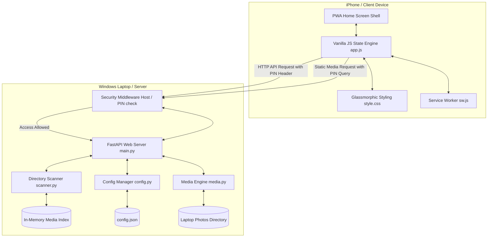
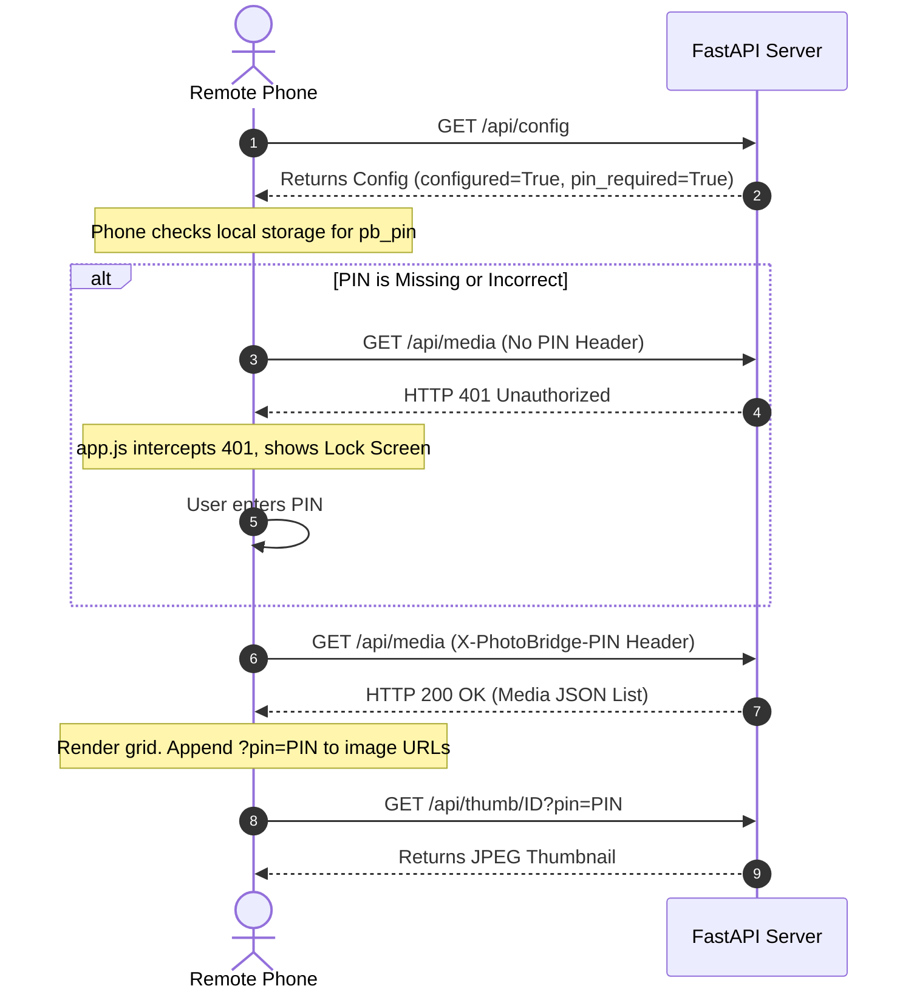

# PhotoBridge Architecture

PhotoBridge is a high-performance, lightweight, offline-first Progressive Web App (PWA) designed to stream and browse photos and videos directly from a Windows laptop (host/server) to an iPhone (client) over a local network (Wi-Fi).

This document details the system design, data flows, security mechanisms, and module structure of the application.

---

## 🗺️ High-Level System Architecture



---

## 📦 Module Breakdown

### 1. Backend Modules (Python / FastAPI)

* **`run.py`**: Entry point. Spawns the Uvicorn web server in a background daemon thread so the main thread can capture interactive `ENTER` keystrokes for safe server shutdowns.
* **`app/main.py`**: The FastAPI controller. Declares HTTP endpoints, configures Pydantic validation models, hosts tkinter folder dialogue loops inside sub-threads (`asyncio.to_thread`), and enforces LAN routing constraints.
* **`app/config.py`**: Configures port settings, absolute folder targets, and access PIN values stored inside `config.json`.
* **`app/scanner.py`**: Recursively crawls the target folder to extract creation timestamps (parsing EXIF tags) and hashes unique base64 IDs. Features a $O(N)$ second-pass algorithm to detect Live Photo pairs by matching base image (`.HEIC`/`.JPG`) and video (`.MOV`/`.MP4`) filenames.
* **`app/media.py`**: Serves media binaries. Utilizes Pillow and `pillow-heif` to generate on-the-fly JPEG thumbnails and runs an custom range-response generator to support HTML5 video scrubbing.

### 2. Frontend Modules (PWA Shell / Vanilla CSS & JS)

* **`static/index.html`**: Serve template shell optimized for iOS Safari viewports (`viewport-fit=cover`).
* **`static/app.js`**: Contains the state machine (`state`), image lazy-loader (`IntersectionObserver`), custom REST request wrappers (`authedFetch`), and layouts (date sections, full-screen slider, folder list).
* **`static/style.css`**: Enforces a unified premium dark design matching Apple’s interface (Apple system fonts, translucent modal backdrops, scale-down buttons, circular navigation buttons, and animated SVGs).
* **`static/manifest.json` & `static/sw.js`**: PWA registry and offline shell assets caching.

---

## 🔒 Security Architecture

PhotoBridge incorporates multiple security layers to protect your laptop's filesystem and privacy on shared Wi-Fi networks:



### 1. File Selector Loopback Protection
Any endpoints altering directories or triggering tkinter popups (`POST /api/config` and `POST /api/select-folder`) check if the incoming connection is a local loopback request (`127.0.0.1`, `localhost`, `::1`). Remote network calls are rejected with a `403 Forbidden` error.

### 2. Access PIN Authentication
When a security PIN is set:
* All data endpoints require verification via `Depends(verify_access_pin)`.
* Custom JavaScript fetches send the PIN inside the `X-PhotoBridge-PIN` request header.
* Native HTML tags (e.g. `` and `<video>`) append the PIN inside the query parameters (`?pin=XXXX`).
* Invalid pins prompt a redirection to a secure, glassmorphic lock screen.

### 3. Path Traversal Defense
No absolute or relative file paths are exposed or accepted by the client. Files are mapped to in-memory URL-safe base64 indices generated during the scanner sweep. Requesting paths outside of scanned scopes yields a standard `404 Media not found`.

---

## 🔄 Key Functional Flows

### 1. PWA Live Photo Merging Flow
1. The backend pairs `IMG_0001.HEIC` and `IMG_0001.MOV` and sets `live_video_id` in the image metadata.
2. In the viewer, the frontend renders a hidden `<video>` element stacked behind the still ``. Long-pressing (or clicking-and-holding) displays the video and calls `.play()` (with haptic feedback) to preview the Live Photo.
3. Tapping the download button downloads both the still image and video binary.
4. If the Web Share API is available, the files are shared simultaneously:
   `navigator.share({ files: [imageFile, videoFile] })`
5. On iOS, the native Share Sheet merges the two files back into a single **Live Photo** in the camera roll.

### 2. Albums Sub-navigation Flow
```mermaid
stateDiagram-v2
    [*] --> AlbumGrid : Open Albums Tab
    AlbumGrid --> AlbumDetail : Tap Album Card
    Note over AlbumGrid: Displays full-screen grid of folder covers and counts
    AlbumDetail --> AlbumGrid : Tap '◀ Albums' Back Button
    AlbumDetail --> AllPhotos : Tap 'All Photos' Tab
    AlbumGrid --> AllPhotos : Tap 'All Photos' Tab
    AllPhotos --> AlbumGrid : Tap 'Albums' Tab (resets state)
```
1. `getAlbumList()` groups scanned files by sub-directory. It sorts folders alphabetically and selects the first image file in each folder as the cover photo.
2. If `state.inAlbumDetail` is `false`, a full-screen card grid displays each folder.
3. Clicking a card updates `state.selectedAlbum`, sets `state.inAlbumDetail` to `true`, and renders the specific photo list with a sticky navigation back bar.
