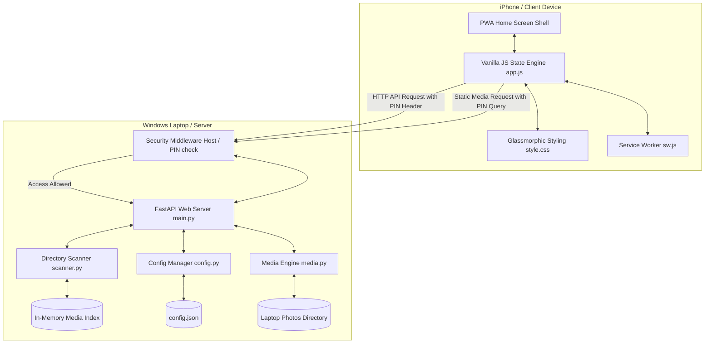
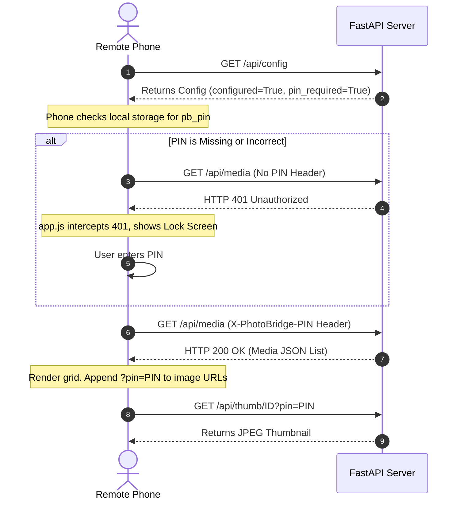

# PhotoBridge Architecture

PhotoBridge is a high-performance, lightweight, offline-first Progressive Web App (PWA) designed to stream and browse photos and videos directly from a Windows laptop (host/server) to an iPhone (client) over a local network (Wi-Fi).

This document details the system design, data flows, security mechanisms, and module structure of the application.

---

## 🗺️ High-Level System Architecture



---

## 📦 Module Breakdown

### 1. Backend Modules (Python / FastAPI)

* **`run.py`**: Entry point. Spawns the Uvicorn web server in a background daemon thread with `atexit` teardown handlers for `.thumbcache/`.
* **`app/main.py`**: The FastAPI controller. Offloads image resizing and disk I/O to background Starlette thread pools (`def` endpoints), hosts HTTP request logging middleware (`log_requests_middleware`), and enforces `Cache-Control: private, no-store, must-revalidate` mobile privacy headers.
* **`app/logger.py`**: Process-safe, file-backed logger (`backend/app.log`). Captures request timing (`ms`), client IP, status codes, and error events across subprocess boundaries.
* **`app/config.py`**: Configures port settings, absolute folder targets, and access PIN values stored inside `config.json`.
* **`app/scanner.py`**: Crawls target directories using lightweight `os.stat` calls (metadata only, no PIL image decoding). Recursively pairs Live Photo pairs (`.HEIC`/`.JPG` + `.MOV`/`.MP4`) and counts album media in a daemon thread.
* **`app/media.py`**: Serves media binaries with disk-cached thumbnails (`backend/.thumbcache/`), range-response video streaming, and `clear_thumb_cache()` auto-teardown handlers.

### 2. Windows Desktop Control Center & Launchers
* **`desktop_gui/gui_app.py`**: A native Tkinter desktop Control Center (`520x680` geometry).
  * **Live Log Viewer Window (`📋 View Server Logs`)**: Spawns a Toplevel Tkinter log viewer window with real-time 1.5s auto-refreshing logs, level-based syntax highlighting (`[INFO]`, `[WARN]`, `[ERROR]`), and Refresh/Clear controls.
  * **Dynamic Resizing**: Wraps status labels based on current window width (`minsize(500, 640)`).
  * **UAC Firewall Automation**: Executes UAC-elevated PowerShell scripts to install/uninstall inbound Port 8000 firewall rules (`netsh`).
  * **Windowless Server Spawning**: Launches `backend/run.py` passing `creationflags=subprocess.CREATE_NO_WINDOW` on Windows.
  * **Automatic Cache Teardown**: Automatically purges `backend/.thumbcache/` on window closure, server stop, or application launch.
* **`run_control_center.bat`**: Double-clickable launcher script. Activates `.venv`, verifies dependencies, and invokes `gui_app.py` via `pythonw.exe`.

### 3. Frontend Modules (PWA Shell / Vanilla CSS & JS)

* **`frontend/index.html`**: Service template shell optimized for iOS Safari viewports (`viewport-fit=cover`).
* **`frontend/app.js`**: Single-page application state machine with:
  * **AbortController Request Manager**: Aborts pending thumbnail downloads when switching tabs or clicking a photo.
  * **HTML5 Video Decoder Cleanup**: Pauses, strips `src`, and calls `.load()` on `<video>` elements on swipe or exit, preventing decoder memory leaks.
  * **Album Cover Art Selection**: Automatically selects the first photo file (`.jpg`/`.png`/`.heic`) as album cover art.
  * **Clean Consumer UI**: Removed administrative buttons (`Settings`/`Logs`) for a pure photo browsing experience on mobile devices.
* **`frontend/style.css`**: Premium dark theme featuring shimmer loading placeholders and iOS Photos glassmorphism video badges (`▶ VIDEO`).
* **`frontend/manifest.json` & `frontend/sw.js`**: PWA registry (`photobridge-v28`) caching static app shell assets only.

---

## 🔒 Security Architecture

PhotoBridge incorporates multiple security layers to protect your laptop's filesystem and privacy on shared Wi-Fi networks:



### 1. File Selector Loopback Protection
Any endpoints altering directories or triggering tkinter popups (`POST /api/config` and `POST /api/select-folder`) check if the incoming connection is a local loopback request (`127.0.0.1`, `localhost`, `::1`). Remote network calls are rejected with a `403 Forbidden` error.

### 2. Access PIN Authentication
When a security PIN is set:
* All data endpoints require verification via `Depends(verify_access_pin)`.
* Custom JavaScript fetches send the PIN inside the `X-PhotoBridge-PIN` request header.
* Native HTML tags (e.g. `` and `<video>`) append the PIN inside the query parameters (`?pin=XXXX`).
* Invalid pins prompt a redirection to a secure, glassmorphic lock screen.

### 3. Path Traversal Defense
No absolute or relative file paths are exposed or accepted by the client. Files are mapped to in-memory URL-safe base64 indices generated during the scanner sweep. Requesting paths outside of scanned scopes yields a standard `404 Media not found`.

---

## 🔄 Key Functional Flows

### 1. PWA Live Photo Merging Flow
1. The backend pairs `IMG_0001.HEIC` and `IMG_0001.MOV` and sets `live_video_id` in the image metadata.
2. In the viewer, the frontend renders a hidden `<video>` element stacked behind the still ``. Long-pressing (or clicking-and-holding) displays the video and calls `.play()` (with haptic feedback) to preview the Live Photo.
3. Tapping the download button downloads both the still image and video binary.
4. If the Web Share API is available, the files are shared simultaneously:
   `navigator.share({ files: [imageFile, videoFile] })`
5. On iOS, the native Share Sheet merges the two files back into a single **Live Photo** in the camera roll.

### 2. Albums Sub-navigation Flow
```mermaid
stateDiagram-v2
    [*] --> AlbumGrid : Open Albums Tab
    AlbumGrid --> AlbumDetail : Tap Album Card
    Note over AlbumGrid: Displays full-screen grid of folder covers and counts
    AlbumDetail --> AlbumGrid : Tap '◀ Albums' Back Button
    AlbumDetail --> AllPhotos : Tap 'All Photos' Tab
    AlbumGrid --> AllPhotos : Tap 'All Photos' Tab
    AllPhotos --> AlbumGrid : Tap 'Albums' Tab (resets state)
```
1. `getAlbumList()` groups scanned files by sub-directory. It sorts folders alphabetically and selects the first image file in each folder as the cover photo.
2. If `state.inAlbumDetail` is `false`, a full-screen card grid displays each folder.
3. Clicking a card updates `state.selectedAlbum`, sets `state.inAlbumDetail` to `true`, and renders the specific photo list with a sticky navigation back bar.
