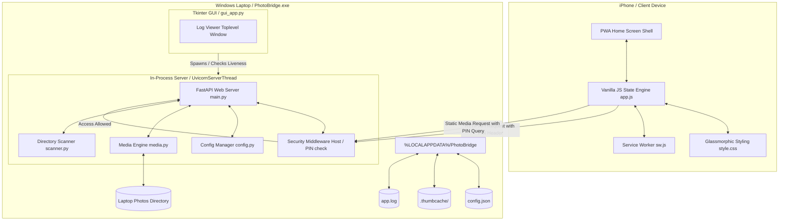
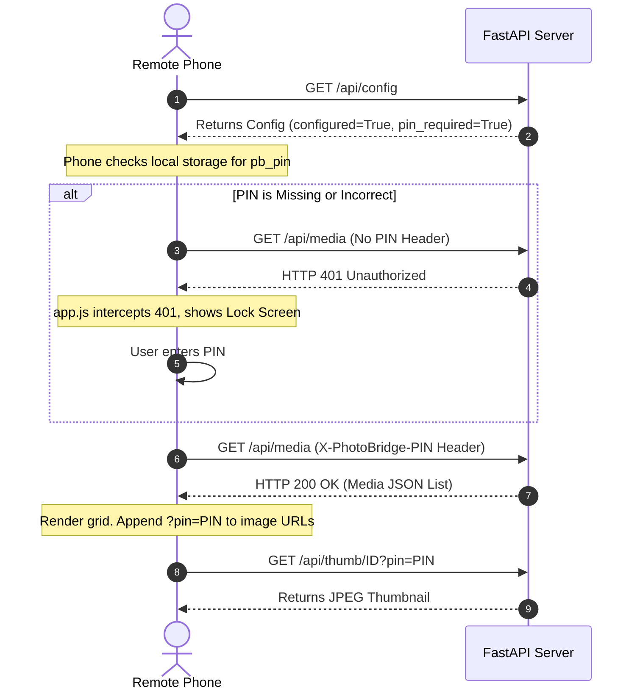

# PhotoBridge Architecture

PhotoBridge is a high-performance, lightweight, offline-first Progressive Web App (PWA) designed to stream and browse photos and videos directly from a Windows laptop (host/server) to an iPhone (client) over a local network (Wi-Fi).

This document details the system design, data flows, security mechanisms, and module structure of the application.

---

## 🗺️ High-Level System Architecture

### 1. Standalone Application Boundary
When packaged as a standalone application, all runtime components (Tkinter GUI, FastAPI, Uvicorn, Python runtime, and static web assets) are compiled into a single executable `PhotoBridge.exe`. Read-only files are extracted to `sys._MEIPASS` (temp path) upon startup, while user-writable files (configurations, logs, and caches) are stored in the user's local application data folder `%LOCALAPPDATA%\PhotoBridge`.

---

## 📦 Module Breakdown

### 1. Backend Modules (Python / FastAPI)

* **`run.py`**: Spawns the Uvicorn web server. When running as a frozen executable, Uvicorn runs in-process as a background daemon thread (`UvicornServerThread`) with `log_config=None` to prevent crash-on-startup issues caused by console-less environments. Also queries the system's hostname to print a persistent host-based `.local` connection address.
* **`app/paths.py`**: Central path manager. Routes asset searches to `sys._MEIPASS` when frozen and relocates configurations, logs, and caches to `%LOCALAPPDATA%\PhotoBridge` to conform to Windows filesystem write privileges.
* **`app/main.py`**: FastAPI controller. Implements synchronous `def` endpoints to offload slow disk operations (such as recursive directory walking) to FastAPI's background thread pool, preventing main asyncio event loop blockages.
* **`app/logger.py`**: Process-safe, file-backed logger writing to `%LOCALAPPDATA%\PhotoBridge\app.log`. Logs API endpoints, timings, client IPs, and critical exceptions.
* **`app/config.py`**: Handles system configurations, directory locations, and access PIN values stored in `config.json`.
* **`app/scanner.py`**: Crawls local photos directory. Recursively pairs Live Photo items (`.HEIC`/`.JPG` + `.MOV`/`.MP4`) and caches album counts.
* **`app/media.py`**: Generates resized JPEG thumbnails, manages the disk cache (`.thumbcache/`), and handles range responses for video streaming.

### 2. Windows Desktop Control Center & Launchers
* **`desktop_gui/gui_app.py`**: A native Tkinter desktop Control Center featuring a premium split-pane dark navy layout (v2):
  * **In-Process Monitor**: Spawns the server as a background thread and monitors thread liveness. If the thread crashes, it changes status indicators immediately to "Stopped".
  * **mDNS Connection Display**: Resolves system hostname using Python's `socket` library to show the easy-to-remember `.local` bookmark address alongside the numeric IP, with one-click copy buttons next to all URLs.
  * **UAC Firewall Automation**: Employs the Win32 `ShellExecuteW` API with the `"runas"` verb to run administrative PowerShell firewall scripts invisibly, safely handling path and quote escaping.
  * **Live Log Viewer Window**: Displays real-time logs fetched directly from the relocated `app.log` file.
  * **Update Checker**: Dynamically checks the latest releases via the GitHub API asynchronously on a background thread.
* **`PhotoBridge.spec`**: Configures the PyInstaller compile steps, bundling assets, icon configurations, metadata exclusions, and windowless execution binaries. Runs the version synchronizer script.
* **`installer/PhotoBridge.iss`**: Script for the Inno Setup compiler to generate the Windows installer. Automates adding/removing firewall rules. Resolves the application version dynamically from the root `VERSION` file at compile-time using Inno Setup Preprocessor (ISPP).

### 3. Frontend Modules (PWA Shell / Vanilla CSS & JS)
* **`frontend/index.html`**: Service template shell optimized for iOS Safari viewports (`viewport-fit=cover`).
* **`frontend/app.js`**: Single-page application state engine featuring request cancellations (`AbortController`) and dynamic video buffer cleanups to conserve iPhone hardware resources.
* **`frontend/style.css`**: Apple Photos style glassmorphic CSS styling.
* **`frontend/sw.js`**: Service Worker caching app shell assets only.

---

## 🔒 Security Architecture

### 1. Localhost Setup Lock
Any actions altering directories or displaying local dialogues (`POST /api/config` and `POST /api/select-folder`) check if the incoming connection is originating from the host machine loopback address (`127.0.0.1`, `localhost`). Remote calls are rejected with a `403 Forbidden` error.

### 2. Access PIN Authentication
When a security PIN is configured, all media endpoints require validation. 
* **Salted PBKDF2 Hash**: The PIN is stored as a salted PBKDF2-HMAC-SHA256 hash (`salt$hash` with 100,000 iterations) inside `config.json` for server authentication.
* **XOR Local Obfuscation**: The local host GUI stores and retrieves the PIN using a local XOR-obfuscation key (`access_pin_local`), permitting secure unmasked viewing within the laptop console while hiding raw plaintext from casual text-editor views.
* **Client-IP Sliding Window Rate Limiting**: The server tracks failed PIN attempts by client IP. If a client records 5 consecutive failed attempts, it is locked out for 60 seconds. Subsequent requests return a `429 Too Many Requests` status code with a retry timer.
* **Local GUI Isolation**: PIN setup and editing is restricted entirely to the host laptop GUI. Remote web app clients cannot set, modify, or delete the PIN, and API POST calls attempting to submit PIN configurations are blocked.
* **Client Transport**: Authorized JavaScript web requests transmit the PIN inside the `X-PhotoBridge-PIN` header, while native page elements (``/`<video>`) attach the PIN via the `?pin=XXXX` query string.

### 3. Path Traversal Defense
No absolute or relative file paths are exposed or accepted by the client. Files are mapped to in-memory URL-safe base64 indices generated during the scanner sweep.
